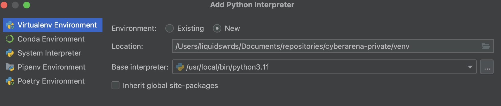
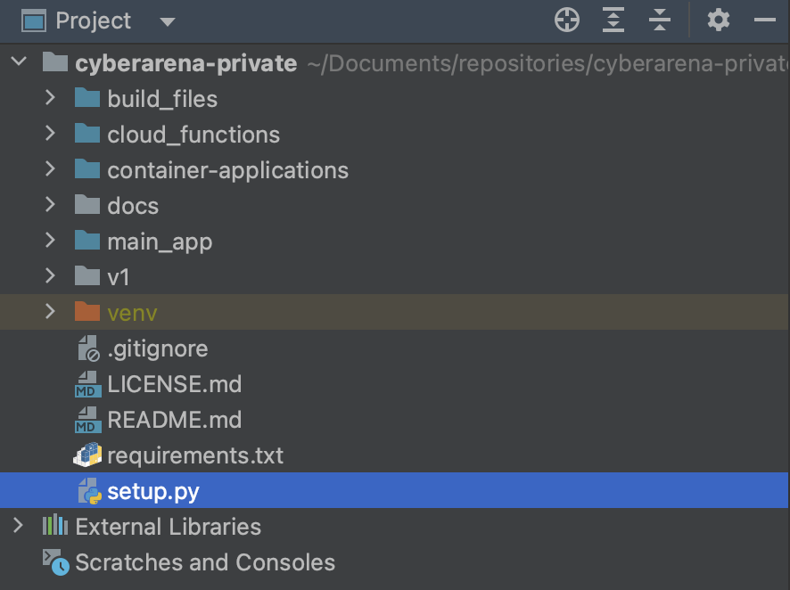

# Building a new workout from scratch

## Introduction

This instruction will walk you through the process of creating a new workout from scratch. These instructions will walk you though the Google Cloud Platform (GCP); building the Instances and creating an image for the Instances. Then how to create a workout YAML file and finally how to use the setup script to push the workout to the Web Application.

## Table of Contents

1. Setup Computer
   1. Google Cloud SDK
   2. GIT Repository
   3. Python
   4. PyCharm
2. GCP
   1. Instances
   2. Images
3. YAML - Specifics
4. Setup Script

## Setup Computer

Before you start to work on anything else, lets walk you though setting up your computer to interact with the Cyber Arena backend. This will include installing the Google Cloud SDK, cloning the GIT repository and installing PyCharm. Before you begin you will need to make sure you have a Google account and have been added to the Cyber Arena project. Talk with one of the following people to get added to the project:  

- [ ] Dr. Philip Huff
- [ ] Andrew Bomberger
- [ ] William Cox
- [ ] Sandra Leiterman
- [ ] Becky \"DFIR\" Passmore

### Google Cloud SDK

To install and setup the Google Cloud SDK follow the instructions found here: [https://cloud.google.com/sdk/docs/install-sdk](https://cloud.google.com/sdk/docs/install-sdk)

You can select from the following Operating Systems:

1. Linux
2. Debian/Ubuntu
3. Red Hat/Fedora/CentOS
4. macOS
5. Windows
6. Chromebook

### GIT Repository

GIT is a version control system that allows you to track changes to files and folders. The Cyber Arena uses GIT to track changes to the backend code. The Cyber Arena uses GIT Hub to host the GIT repository. You will need to create an account and get access to the Private repository before you proceed.

Contact one of the following people to get access to the repository:

- [ ] Dr. Philip Huff
- [ ] Andrew Bomberger
- [ ] William Cox

We will walk through the following instructions:

1. Install GIT Application
   1. GIT Hub Desktop
   2. GIT Command Line
2. Clone the Cyber Arena GIT Repository
3. Create a new branch for your work
4. Push your changes to the GIT Repository
5. Fixing merge conflicts

#### Install GIT Application

There are two ways to install GIT on your computer. The first is to install the GIT Hub Desktop application. This application will allow you to clone the repository and push changes to the repository. The second is to install the GIT command line application.

***Note: The author of this document does not condone the use of superfluous GUI applications.***

##### GIT Hub Desktop

To install the GIT Hub Desktop application follow the instructions found here: [https://desktop.github.com/](https://desktop.github.com/)

##### GIT Command Line

###### Linux

To install the GIT command line application on Linux follow the instructions found here: [https://git-scm.com/download/linux](https://git-scm.com/download/linux)

###### MacOS

To install the GIT command line application on MacOS follow the instructions found here: [https://git-scm.com/download/mac](https://git-scm.com/download/mac)

###### Windows

To install the GIT command line application on Windows follow the instructions found here: [https://git-scm.com/download/win](https://git-scm.com/download/win)

#### Clone the Cyber Arena GIT Repository

Once you have installed the GIT application you will need to clone the Cyber Arena GIT repository. To do this you will need to navigate to the repository and copy the URL. The URL can be found here: [https://github.com/emerginganalytics/cyberarena-private.git](https://github.com/emerginganalytics/cyberarena-private.git)

##### Github Desktop

Not to be rude but its a GUI application, you should be able to figure this out. If you can't, you should probably not be working on this project.

##### GIT using Terminal

Once you have the URL you can clone the repository using the following command:

```bash
mkdir ~/repository
cd ~/repository
git clone https://github.com/emerginganalytics/cyberarena-private.git
```

- mkdir will create a new folder called repository in your home directory
- cd will change your current directory to the repository folder
- git clone will clone the repository into the repository folder

The repository will be named cyberarena-private. It will look like a normal folder but there will be a `.git` hidden directory inside the folder. This is where all the GIT magic happens.

#### Create a new branch for your work

Once you have cloned the repository you will need to create a new branch for your work. This will allow you to work on your changes without affecting the master branch. To create a new branch you will need to use the following command:

```bash
git checkout -b <branch_name>
```

- git checkout will change your current branch
- -b will create a new branch
- <branch_name> will be the name of your branch

***NOTE:*** *You should use your name for the \<branch_name\>. This will allow you to keep track of your changes.*

#### Push your changes to the GIT Repository

Once you have made changes to the repository you will need to push your changes to the repository. It is good practice to make sure you have the latest changes to ensure you are not going have a merge conflict. 

To do this you will need to use the following commands:

```bash
git add .
git commit -m "<commit_message>"
git push origin <branch_name>
```

- `git add .` will add all the changes you have made to the repository
- `git commit` will commit the changes to the repository
  - `-m`will add a message to the commit
  - `<commit_message>` will be the message you want to add to the commit
- `git push` will push the changes to the repository
  - `origin` will be the remote repository
  - `<branch_name>` will be the name of your branch

#### Fixing merge conflicts

If you have a merge conflict you will need to fix the conflict before you can push your changes to the repository. To do this you will need to use the following commands:

```bash
git pull origin master
```

- `git pull` will pull the latest changes from the remote repository
  - `origin` will be the remote repository
  - `master` will be the branch you want to pull from

Once you have pulled the latest changes you will need to fix the merge conflict. To do this you will need to open the file that has the merge conflict. The file will have the following format:

```vim
<<<<<<< HEAD
This is the code you have changed
=======
This is the code that has been changed in the remote repository
>>>>>>> master
```

You will need to decide which code you want to keep. Once you have decided you will need to remove the merge conflict code and the merge conflict tags. Once you have removed the merge conflict code and tags you will need to add the file to the repository and commit the changes. To do this you will need to use the following commands:

```bash
git add <file_name>
git commit -m "<commit_message>"
git push origin <branch_name>
```

- `git add` will add the file to the repository
  - `<file_name>` will be the name of the file you want to add
- `git commit` will commit the changes to the repository
  - `-m`will add a message to the commit
  - `<commit_message>` will be the message you want to add to the commit
- `git push` will push the changes to the repository
  - `origin` will be the remote repository
  - `<branch_name>` will be the name of your branch

### Python Installation

Python is a programming language that is used to write the backend code for the Cyber Arena. You will need to install Python on your computer to work on the backend code. The Cyber Arena uses Python version 3.9 or higher.

#### Windows

To Install Python follow the directions found here: [https://www.digitalocean.com/community/tutorials/install-python-windows-10](https://www.digitalocean.com/community/tutorials/install-python-windows-10)

```vim
If the direction do not work for you, talk with Andrew Bomberger. 
He is a very patient person and will help you get Python installed. 
Professor Cox will just point and laugh at you because you are using Windows and don't get me started with what Dr. Huff will do.
```

#### Linux

To Install Python follow the directions found here: [https://docs.python-guide.org/starting/install3/linux/](https://docs.python-guide.org/starting/install3/linux/)

Substitute python 3.6 with the newest version of python. if python is already installed you can update it using the following command:

```bash
sudo apt-get update
sudo apt-get upgrade
sudo apt-get install python3
```

#### MacOS

To Install Python follow the directions found here: [https://docs.python-guide.org/starting/install3/osx/](https://docs.python-guide.org/starting/install3/osx/)

### PyCharm

PyCharm is an IDE for Python. It is a very powerful tool that will help you write code. You can download the community edition for free here: [https://www.jetbrains.com/pycharm/download/](https://www.jetbrains.com/pycharm/download/)

#### PyCharm Setup

Once you have downloaded and installed PyCharm you will need to open the CyberArena GIT repository.

##### Adding the repository to PyCharm

1. To do this you will need to open PyCharm and select the option to open a project.
2. You will need to navigate to the repository folder and select the folder.
3. PyCharm will open the project and you will be able to start working on the code.

##### Setting up the Python Interpreter \& Virtual Environment

Next you will need to setup the Python interpreter. To do this you will need to follow the following instructions:

1. Depending on the look you have for PyCharm you will need to navigate to the settings. You can do this by clicking on the gear icon in the top right corner.
2. Expand the `Project: cyberarena-private` section and click on the `Project Interpreter` option.
3. Click add interpreter and select the `add local interpreter` option. 
4. Select Virtualenv Environment
5. Settings:
   1. Environment: New
   2. Location: browse to the repository folder and select the venv folder
   3. Browse to your python interpreter and select it
   4. Click ok

##### Setup Script Settings

Next you will need to configure the setup script to run. To do this you will need to follow the following instructions:

1. Locate and double click on the `setup.py` script from the project explorer. 
2. Top of your screen you will see 

## GCP

Now that you have your computer setup you will need to setup the GCP project. This will include creating the Instances and creating an image for the Instances.

### Instances

1. To create the Instance you will need to navigate to the GCP console [https://console.cloud.google.com/welcome?project=ualr-cybersecurity](https://console.cloud.google.com/welcome?project=ualr-cybersecurity). 
2. Once you have logged in you will need to navigate to the Compute Engine section.
   1. You can do this by clicking on the hamburger menu in the top left corner
   2. Select Compute Engine
3. Once you are in the Compute Engine section you will need to create a new Instance.
   1. You can do this by clicking on the `Create Instance` button located towards the top of the page.
   2. You will need to name the Instance
      - The name should be identifiable to others as to what the Instance is used for in the workout. 
      - ie. student-linux-host, student-attack-host, student-windows-host
      - Instance names need to start with a lowercase letter and can only contain lowercase letters, numbers and dashes.
   3. You will need to select the region and zone for the Instance \(us-central1-a\)
   4. You will need to select the machine type for the Instance
      - The machine type will depend on the workout. 
      - Use one of the E2 machine types.
        - Shared-core types (1 shared core)
          - e2-micro, 
          - e2-small, 
          - e2-medium
        - General-purpose types (up to 8 vCPUs and 64 GB of memory)
          - e2-standard-2, 2 vCPU 4G memory
          - e2-standard-4, 4 vCPU 8G memory
          - e2-standard-8, 8 vCPU 16G memory
      - The machine type can be changed later if needed in the YAML file.
   5. You will need to select the boot disk for the Instance
      - The boot disk is the Hard Drive for the Instance
      - The boot disk is also the operating system for the Instance
      - You can create a custom disk using VMware or VirtualBox.
        - The following link will walk you through the process of creating a custom disk: [https://cloud.google.com/compute/docs/images/create-custom](https://cloud.google.com/compute/docs/images/create-custom)
   6. You will need to select the network for the Instance, which is found under the Advanced options
      - Select the default network
      - Select the cybergym-internal subnetwork (10.1.1.0/24)
      - Select the ephemeral for the External IP v4 address
   7. Once you have selected all the options you will need to click the `Create` button at the bottom of the page.
   8. You will either use RDP or SSH to connect to the Instance you just created. 
      - RDP: [https://cloud.google.com/compute/docs/instances/connecting-to-windows#iap-desktop](https://cloud.google.com/compute/docs/instances/connecting-to-windows#iap-desktop)
      - SSH: [https://cloud.google.com/compute/docs/connect/standard-ssh]https://cloud.google.com/compute/docs/connect/standard-ssh

